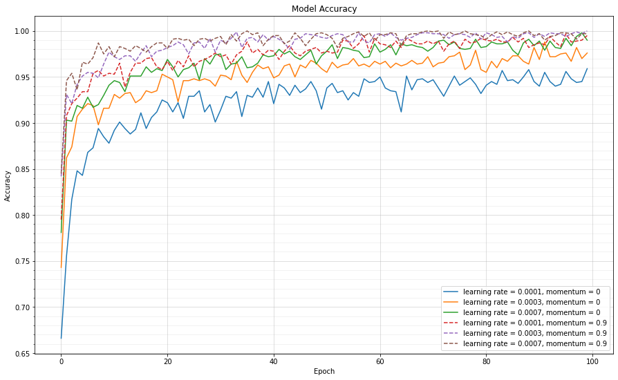
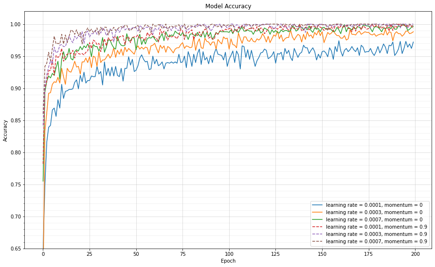
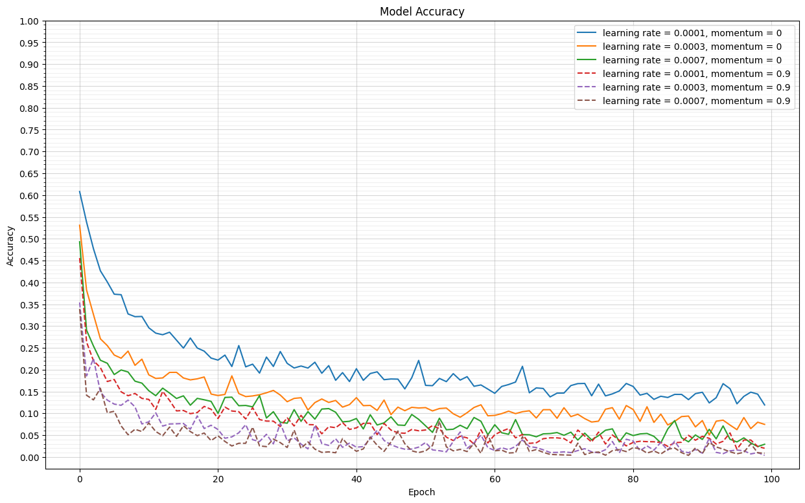
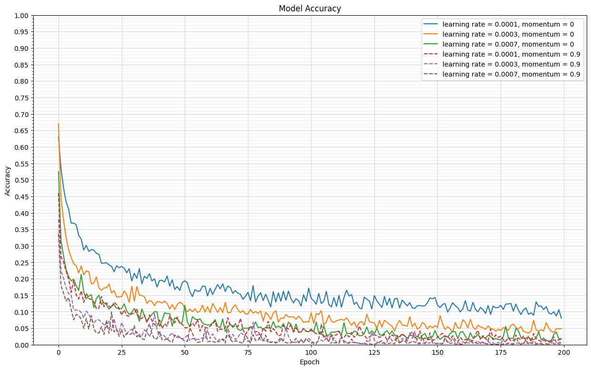

# Poultry-Meat-Freshness-Classification-with-Transfer-Learning-using-ResNet-Architecture
The utilization of the ResNet architecture and **Transfer Learning** methods to classify **Poultry Meat Freshness images** into two categories, namely **Fresh** and **Rotten**.

## About The Project

* In this repository, we leverage the power of the **Residual Networks (ResNet)** architecture and **Transfer Learning** techniques to accurately classify the freshness of poultry meat. By utilizing pre-trained ResNet weights, sourced from **ImageNet**, our model gains the ability to make fine-grained distinctions in poultry meat freshness.
* The pre-trained weights from the **ImageNet** dataset, which includes a wide range of object categories, are used to enhance the model's ability to recognize and classify fresh and rotten poultry meat images.
* This repository provides a comprehensive implementation of the classification process and serves as a valuable resource for exploring the world of Transfer Learning with ResNet architecture.
* Key Features
  * Implementation of Transfer Learning with ResNet architecture.
  * Classification of poultry meat freshness into different categories.
  * Utilizes a pre-trained model to enhance classification accuracy.
  * Implement hyperparameter tuning using Grid Search to obtain the best model/ set of parameters.
  * Helps in maintaining food safety and quality standards.

## Technology Used
* Python
* Numpy
* Pandas
* Matplotlib
* Scikit-learn
* Keras
* Tensorflow

## Dataset Used
  - In this project, we utilize sets of images depicting fresh and spoiled poultry meat sourced from the **Fresh and rotten poultry meat datasets**, accessible at: [Fresh and rotten poultry meat datasets | Kaggle](https://www.kaggle.com/calvinsama/fresh-and-rotten-poultry-meat-datasets).
  - The amount of data used in this project:
    - Training data:
      - Fresh (Segar): 500 images
      - Rotten (Busuk): 500 images
    - Testing data
      - Fresh (Segar): 150 images
      - Rotten (Busuk): 150 images
  - Sample Images
    - Fresh (Segar)
      1 | 2 | 3 | 4 | 5
      :-------------------------:|:-------------------------:|:-------------------------:|:-------------------------:|:-------------------------:
       |  |  |  | 
    - Rotten (Busuk)
      1 | 2 | 3 | 4 | 5
      :-------------------------:|:-------------------------:|:-------------------------:|:-------------------------:|:-------------------------:
       |  |  |   |  

## Workflow
- Data Preparation
- Label Encoding
- Data Preprocessing & Data Augmentation
- Data Splitting
- Model Building
- Model Training & Hyperparameters Tuning
- Model Testing & Evaluation

## Algorithms/ Methods
* This project applies **Transfer Learning** methods by utilizing the **ResNet architecture** with pre-trained weights sourced from **ImageNet**, encompassing around 1000 object categories.
* The training process uses a **fine-tuned method**, which allows all of the layers to update their weights during the training process.
* **Parameters** (Fixed):
  * Batch = 10 (100 steps per epoch, because the number of training data is 1000)
  * Optimizer = Mini Batch Gradient Descent
  * Loss/ Cost Function = Binary Cross Entropy
  * Metrics = Accuracy
* **Hyperparameters** (Fine Tuned with Grid Search):
  * Epoch:
    * 100
    * 200
  * Learning rate:
    * 0.0001
    * 0.0003
    * 0.0007
  * Momentum:
    * 0.0
    * 0.9

## Model Evaluation
  Graph of Epoch & Accuracy (100 epoch) | Graph of Epoch & Accuracy (200 epoch)
  :-------------------------:|:-------------------------:
    |  
  Graph of Loss & Accuracy (100 epoch) | Graph of Loss & Accuracy (200 epoch)
    |  

  - Validation accuracy scores at **Epoch 100**:
    - resnet_lr1e-4_m0_e100: 92.33
    - resnet_lr3e-4_m0_e100: **95.33**
    - resnet_lr7e-4_m0_e100: 94.67
    - resnet_lr1e-4_m09_e100: 93.67
    - resnet_lr3e-4_m09_e100: 92.67
    - resnet_lr7e-4_m09_e100: 92.0
  - Validation accuracy scores at **Epoch 200**:
    - resnet_lr1e-4_m0_e200: 93.0
    - resnet_lr3e-4_m0_e200: 95.0
    - resnet_lr7e-4_m0_e200: **95.67**
    - resnet_lr1e-4_m09_e200: 91.0
    - resnet_lr3e-4_m09_e200: 91.67
    - resnet_lr7e-4_m09_e200: 90.67

## Publication
* [Cendani, L. M., Pangestu, M. A., & Muria, F. (2021). "*Classification of Freshness Quality of Broiler Chicken Breast with Transfer Learning Using ResNet, Inception, and Xception Architectures*".](paper/Klasifikasi%20Kualitas%20Kesegaran%20Daging%20Dada%20Ayam%20Broiler%20dengan%20Transfer%20Learning%20M.pdf) (unpublished)

## Contributors
* [Linggar Maretva Cendani](https://github.com/LinggarM) - [linggarmc@gmail.com](mailto:linggarmc@gmail.com) (ResNet)
* Michael Axel Pangestu (Inception)
* Fatah Muria (Xception)

## License
This project is licensed under the MIT License - see the [LICENSE](LICENSE) file for details

## Acknowledgments
  - Fresh and rotten poultry meat datasets: [https://www.kaggle.com/calvinsama/fresh-and-rotten-poultry-meat-datasets](https://www.kaggle.com/calvinsama/fresh-and-rotten-poultry-meat-datasets).
